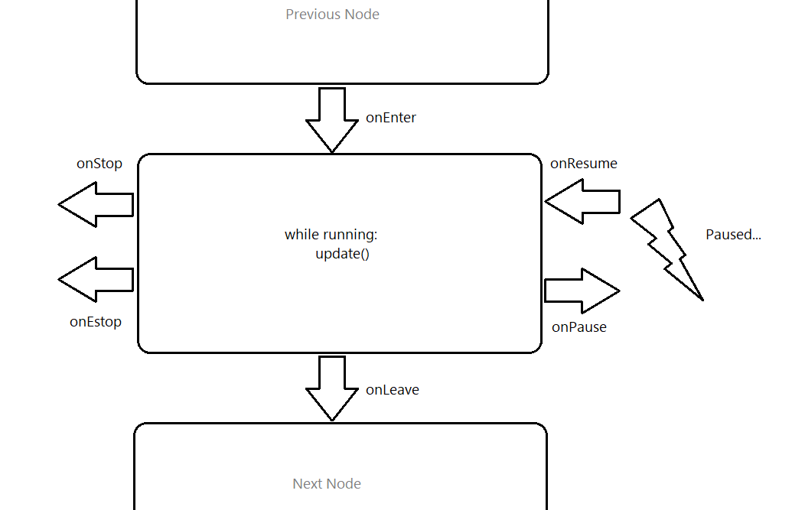

# Getting Started
The Machine App Template should enable you to quickly get the business logic of your application up and running without having to worry about all of the busy-work it takes to glue things together. The goal of this document is to help you better understand the framework that you'll be developing in. The code itself is highly documented, so feel free to explore the project to learn more about the functionality of individual classes and methods. The files that you should care to understand are:
- `server/machine_app.py`: Contains the main business logic of your program as a state machine
- `client/ui.js`: Contains the web application code that you are encouraged to edit (Of course you can edit other files as well, but it is recommended that you stay here)
- `client/styles/ui.css`: The style sheet for the custom JavaScript that you write

At a high-level, the Machine App Template is split into two parts: 
1. A python server that runs the business logic of your program
2. A web-client that updates in response to this python server

## Server
The server itself can be thought of as three different parts:

1. A state machine that runs the business logic of your MachineApp
2. A RESTful http server that fields requests from your web client and propagates them to the MachineApp
3. A websocket server that streams realtime data about your MachineApp to the web client. The web client connects directly to this socket.

As a user of our template, you should only ever have to deal with the first item on this list, but it is good to be aware that the other parts exist, in case your app requires you touch them.

### State Machine
#### State Machine Node (MachineAppState)
At it's core, the server is a state machine made up of state nodes (i.e. `MachineAppState`s). Each node defines some behavior for each type of state transition. The following image demonstrates the lifecycle of a single node in our state machine:



To implement a node, we inherit the `MachineAppState` class, and define, at the very least, the `onEnter` method. For example, a very simple node that moves us from the current state called "Waiting" to a new state called "DoingSomething" after three seconds might look like this:
```python
class WaitingState(MachineAppState):
    def onEnter(self):
        self.startTimeSeconds = time.time()
        self.logger.info('Entered waiting state')
    
    def update(self):
        if time.time() - self.startTimeSeconds > 3.0:
            self.gotoState('DoingSomething')

    def onLeave(self):
        self.logger.info('Left waiting state')

class DoingSomethingState(MachineAppState):
    def onEnter(self):
        self.logger.info('Entered DoingSomething state')
    ...etc
```

Going between states is as easy invoking the `self.gotoState` method with the name of the state that you'd like to transition to. Any other business logic simply gets implemented by overriding the defined methods.

#### State Machine Implementation (MachineAppEngine)
Now that we know how to build discrete state nodes, we need to put them together in the state machine, also known as the `MachineAppEngine`, in `server/machine_app.py`. This class is the heart of your MachineApp. It fields requests from the REST server and manages the state transitions of your application. All of the interactions with the REST server are abstracted way by its superclass called `BaseMachineAppEngine` in `server/internal/base_machine_app.py` (Note: You should never have to touch `BaseMachineAppEngine`, unless you know what you're doing).

Taking our example from before, a `MachineAppEngine` that handles those two states might look something like:
```python
class MachineAppEngine(BaseMachineAppEngine):
    def initialize(self):
        self.machineMotion = MachineMotion('127.0.0.1')
        self.machineMotion.configAxis(1, 8, 250)
        self.machineMotion.configAxis(2, 8, 250)
        self.machineMotion.configAxis(3, 8, 250)
        self.machineMotion.configAxisDirection(1, 'positive')
        self.machineMotion.configAxisDirection(2, 'positive')
        self.machineMotion.configAxisDirection(3, 'positive')

    def onStop(self):
        self.machineMotion.emitStop()

    def onPause(self):
        self.machineMotion.emitStop()

    def beforeRun(self):
        pass

    def afterRun(self):
        pass

    def getMasterMachineMotion(self):
        return self.machineMotion

    def getDefaultState(self):
        return 'Waiting'

    def buildStateDictionary(self):
        stateDictionary = {
            'Waiting': WaitingState(self),
            'DoingSomething': DoingSomethingState(self)
        }

        return stateDictionary

```
A minimal example defines the states that we're using in `buildStateDictionary`, returns the default state in `getDefaultState`, and defines a single instance of `MachineMotion` in `initialize` as the primary controller to which we're talking. All other methods are just helpers in case you need them. You can get more information about `MachineAppEngine` in `server/machine_app.py`.

### Runtime Configuration
On top of doing some straightforward logic via a state machine, you may want to specify some configurable data to your MachineApp at runtime. This is a very common facet of any MachineApp. For example, you may want to send up things like how many times a loop should run, or how long we should wait in our `WaitingState`, etc. 

To do this, you have access to a `MachineAppState::configuration` and `MachineAppEngine::configuration` while your state machine is running. This is a python dictionary that is sent up by the frontend when you click the "play" button. We will explain how this data is defined in the [Client](#client) section later on.

### Reacting to Inputs
Oftentimes in a MachineApp, you'll want to do something when an input is triggered. For example, we might want to change our state only when an operator pushes a button. The MachineApp template provides you with the `MachineAppState::registerCallback` method. This method takes as its parameters (1) the machine motion whose topics you want to subscribe to, (2) the topic that you want to subscribe to, and (3) a callback to be invoked when we receive data on that topic.

You can either pass the topic directly, or, alternatively, get the topic of a particular input by its registered name. To register an input for a particualr machine motion, you can do the following in `server/machine_app.py`:
```python
class MachineAppEngine(BaseMachineAppEngine):
    def initialize(self):
        self.machineMotion = MachineMotion('127.0.0.1')
        # ... Configure your axes and whatnot ...
        self.machineMotion.registerInput('push_button_1', 1, 1)  # Registering IO module 1 and pin 1 to the name 'push_button_1'

    ... etc
```

Then, in your MachineAppState, you can wait on this push button as shown below:

```python
class WaitingOnInputState(MachineAppState):
    def onEnter(self):
        def __onMqttMessageReceived( topic, msg):
            if msg == 'true':
                self.gotoState('ButtonClickedState')
                
        self.registerCallback(self.engine.machineMotion, self.engine.machineMotion.getInputTopic('push_button_1'), __onMqttMessageReceived)
```

This state machine node waits for a message containing "true" to be published to the fictitious `push_button_1` input. We could, alternatively, pass an MQTT topic directly to the `MachineAppState::registerCallback` method in place of the result of `MachineMotion::getInputTopic`.

### Streaming Data to the Web Client (Notifier)
The final part of the server that you'll use is the `Notifier`, located in `server/internal/notifier.py`. The `Notifier` provides you with a simple mechanism for streaming data directly to the web client over a WebSocket. This streamed data is presented to you in the "Information Console" panel on the frontend. Each `MachineAppState` that you initialize has a reference to the global notifier by default, so you should never construct one yourself.

As an example, if we  take our `WaitingState` mentioned earlier, we may want to send out a notification to the client after the 3 second timeout is up. An implementation of that would look something like this:
```python
class WaitingState(MachineAppState):
    def onEnter(self):
        self.startTimeSeconds = time.time()
        self.logger.info('Entered waiting state')
    
    def update(self):
        if time.time() - self.startTimeSeconds > 3.0:
            self.notifier.sendMessage(NotificationLevel.INFO, '3 seconds are up!', { 'waitedFor': 3 }) # This message is sent to the client
            self.gotoState('DoingSomething')

    def onLeave(self):
        self.logger.info('Left waiting state')
```

## Client
The client is a simple web page that relies on JQuery to do some heavy lifting. It is served up as three separate JavaScript files and two separate CSS files by the Python http server. The files that you should concern yourself with mostly are:
- `client/ui.js` - Contains all custom frontend logic
- `client/widgets.js` - Contains widgets that are helpful for building forms
- `client/styles/ui.css` - Contains all custom frontend styles

### Configuration Editor
As we said in the [server's configuration section](#runtime-configuration), you can publish a configuration to your MachineApp engine when you hit the "play" button. This configuration is defined entirely on the frontend in `client/ui.js`.

As an example, let's pretend that we want to send up the "wait time in seconds" to the server for our fictitious "WaitingState" example (mentioned previously). In `client/ui.js`, we would implement the provided mehtods like so:
```js
function getDefaultConfiguration() {
    return {
        waitTimeSeconds: 3.0
    }
}

function buildEditor(pConfiguration) {
    const lEditorWrapper = $('<div>').addClass('configuration-editor'),
        lFullSpeedEitor = numericInput('Wait Time (seconds)',  pConfiguration.waitTimeSeconds, function(pValue) {
                pConfiguration.waitTimeSeconds = pValue;
            }).appendTo(lEditorWrapper);

    return lEditorWrapper;
}
```

`getDefaultConfiguration` defines the data that we will send to the backend regardless of whether or not the user edits any of it in the editor. `buildEditor` constructs a user interface for our data using the widgets from `client/widgets.js`. 

Now, on the backend in our "WaitingState", we might access the `waitTimeSeconds` variable like so:

```python
class WaitingState(MachineAppState):
    def onEnter(self):
        self.waitTimeSeconds = self.configuration["waitTimeSeconds"]
    ...
```

### Updating the UI from Streamed Data
As we explained in the [server's notifier section](#streaming-data-to-the-web-client-notifier), the server can stream data to the client while it is running via a WebSocket. The client establishes this connection in `client/index.js` when the page is loaded, so you won't have to worry about that part. When we receive a message from this connection, we first add it to the Information Console with an icon describing what type of message it is (this happens in `client/index.js`). We then hand off the message to the `onNotificationReceived` callback in `client/ui.js`. This is where you will implement any custom UI that you'd like to show for certain messages.

For example, if our WaitingState from the previous section looked like this:
```python
class WaitingState(MachineAppState):
    def onEnter(self):
        self.waitTimeSeconds = self.configuration["waitTimeSeconds"]
        self.notifier.sendMessage(NotificationLevel.INFO, 'Received wait time', { waitTimeSeconds: self.waitTimeSeconds })
    ...
```

We could then implement the `onNotificationReceived` in `client/ui.js` like so to append the "waitTimeSeconds" variable to our custom container:
```js
function onNotificationReceived(pLevel, pMessageStr, pMessagePayload) {
    const lCustomContainer = $('#custom-container');
    if (pMessagePayload.waitTimeSeconds) {
        lCustomContainer.append($('<div>').text(pMessagePayload.waitTimeSeconds));
    }
}
```

Obviously you'd want to do something much fancier than this, but this should give you a general idea of how things work.